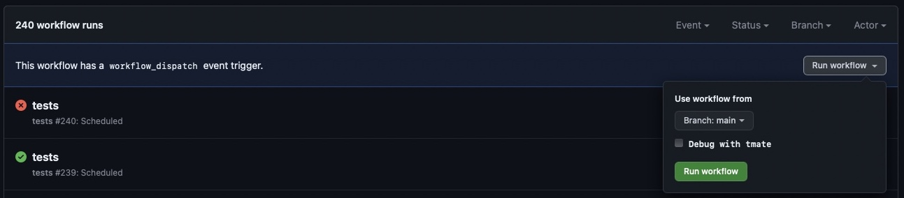

[](https://github.com/ddev/ddev-addon-template/actions/workflows/tests.yml) 

# ddev-addon-template <!-- omit in toc -->

* [What is ddev-addon-template?](#what-is-ddev-addon-template)
* [Components of the repository](#components-of-the-repository)
* [Getting started](#getting-started)
* [How to debug in Github Actions](#how-to-debug-in-github-actions)

## What is ddev-addon-template?

This repository is a template for providing [DDEV](https://ddev.readthedocs.io) add-ons and services.

In DDEV addons can be installed from the command line using the `ddev get` command, for example, `ddev get ddev/ddev-redis` or `ddev get ddev/ddev-solr`.

This repository is a quick way to get started. You can create a new repo from this one by clicking the template button in the top right corner of the page.


## Components of the repository

* The fundamental contents of the add-on service or other component. For example, in this template there is a [docker-compose.addon-template.yaml](docker-compose.addon-template.yaml) file.
* An [install.yaml](install.yaml) file that describes how to install the service or other component.
* A test suite in [test.bats](tests/test.bats) that makes sure the service continues to work as expected.
* [Github actions setup](.github/workflows/tests.yml) so that the tests run automatically when you push to the repository.

## Getting started

1. Choose a good descriptive name for your add-on. It should probably start with "ddev-" and include the basic service or functionality. If it's particular to a specific CMS, perhaps `ddev-<CMS>-servicename`.
2. Create the new template repository by using the template button.
3. Globally replace "addon-template" with the name of your add-on.
4. Add the files that need to be added to a ddev project to the repository. For example, you might remove `docker-compose.addon-template.yaml` with the `docker-compose.*.yaml` for your recipe.
5. Update the install.yaml to give the necessary instructions for installing the add-on.

   * The fundamental line is the `project_files` directive, a list of files to be copied from this repo into the project `.ddev` directory.
   * You can optionally add files to the `global_files` directive as well, which will cause files to be placed in the global `.ddev` directory, `~/.ddev`.
   * Finally, `pre_install_commands` and `post_install_commands` are supported. These can use the host-side environment variables documented [in ddev docs](https://ddev.readthedocs.io/en/stable/users/extend/custom-commands/#environment-variables-provided).

6. Update `tests/test.bats` to provide a reasonable test for your repository. Tests are triggered either by manually executing `bats ./tests/test.bat`, automatically on every push to the repository, or periodically each night. Please make sure to attend to test failures when they happen. Others will be depending on you. `bats` is a simple testing framework that just uses `bash`. To run a Bats test locally, you have to [install bats-core](https://bats-core.readthedocs.io/en/stable/installation.html) first. Then you download your add-on, and finally run `bats ./tests/test.bats` within the root of the uncompressed directory. To learn more about Bats see the [documentation](https://bats-core.readthedocs.io/en/stable/).
7. When everything is working, including the tests, you can push the repository to GitHub.
8. Create a release on GitHub.
9. Test manually with `ddev get <owner/repo>`.
10. You can test PRs with `ddev get https://github.com/<user>/<repo>/tarball/<branch>`
11. Update the README.md to describe the add-on, how to use it, and how to contribute. If there are any manual actions that have to be taken, please explain them. If it requires special configuration of the using project, please explain how to do those. Examples in [ddev/ddev-solr](https://github.com/ddev/ddev-solr), [ddev/ddev-memcached](github.com/ddev/ddev-memcached), and (advanced) [ddev-platformsh](https://github.com/ddev/ddev-platformsh).
12. Add a good short description to your repo, and add the label "ddev-get". It will immediately be added to the list provided by `ddev get --list --all`.
13. When it has matured you will hopefully want to have it become an "official" maintained add-on. Open an issue in the [ddev queue](https://github.com/ddev/ddev/issues) for that.

Note that more advanced techniques are discussed in [DDEV docs](https://ddev.readthedocs.io/en/latest/users/extend/additional-services/#additional-service-configurations-and-add-ons-for-ddev).

## How to debug tests (Github Actions)

1. You need a SSH-key registered with Github. You either pick the key you already authenticate with `github.com` or you create a dedicated new one with `ssh-keygen -t ed25519 -a 64 -f tmate_ed25519 -C "$(date +'%d-%m-%Y')"` and add it at `https://github.com/settings/keys`.

2. Add the following snippet to `~/.ssh/config`

```
Host *.tmate.io
    User git
    AddKeysToAgent yes
    UseKeychain yes
    PreferredAuthentications publickey
    IdentitiesOnly yes
    IdentityFile ~/.ssh/tmate_ed25519
```
3. Go to `https://github.com/<user>/<repo>/actions/workflows/tests.yml`.

4. Click the `Run workflow`- button and you will have the option to the select the branch to run the workflow from and activate `tmate` by checking the `Debug with tmate` checkbox for this run.



5. After the `workflow_dispatch`-event was triggered click the `All workflows`-link in the sidebar and then click the in progress workflow `tests`.

7. Pick one of the jobs in progress in the sidebar.

8. Wait until the current task list reaches the `tmate debugging session` section and the output shows something like:

```
106 SSH: ssh PRbaS7SLVxbXImhjUqydQBgDL@nyc1.tmate.io
107 or: ssh -i <path-to-private-SSH-key> PRbaS7SLVxbXImhjUqydQBgDL@nyc1.tmate.io
108 SSH: ssh PRbaS7SLVxbXImhjUqydQBgDL@nyc1.tmate.io
109 or: ssh -i <path-to-private-SSH-key> PRbaS7SLVxbXImhjUqydQBgDL@nyc1.tmate.io
```

9. Copy and execute the first option `ssh PRbaS7SLVxbXImhjUqydQBgDL@nyc1.tmate.io` in the terminal and continue by pressing either `q` or `ctrl-c`.

10. Start the bats test with `bats tests/test.bats`.

For a more detailed documentation about `tmate` see [Debug your GitHubActions by using tmate](https://mxschmitt.github.io/action-tmate/)


**Contributed and maintained by [@CONTRIBUTOR](https://github.com/CONTRIBUTOR)**
